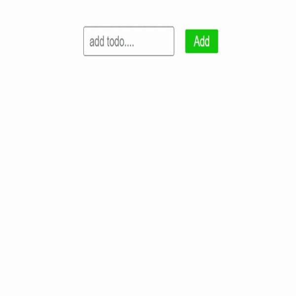

<h1 align="center">Todo App - React-Readux|Redux-ToolKit</h1>
<h3>Create a to-do list as simple or detailed as you need</h3>

<h3>Technologies Used</h3>

[Add your daily task](https://nidhisharma63.github.io/redux-tutorial/)

 